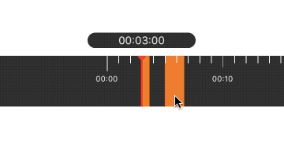

<p align="center" >

</p>


This library provides an smart time frame. For convenience, we added  UI elements like `WLTimePointer`, `WLTimeFrameView`.

## Features

- [x] scroll time frame for 24hours


## Requirements

- iOS 8.0 or later
- Xcode 9.0 or later

## Getting Started

- Read this Readme doc


## Communication

- If you **need help**, use [luowanglin mail](luowanglin@icloud.com).
- If you'd like to **ask a general question**, use [luowanglin](luowanglin@icloud.com).
- If you **found a bug**, open an issue.
- If you **have a feature request**, open an issue.
- If you **want to contribute**, submit a pull request.
- If you **want to about me**,click to [my page](https://luowanglin.github.io)

## How To Use

* Swift

```swift
import WLTimeFrame

let source:[WLTimeSpaceModel] = [WLTimeSpaceModel(startTime: 180.0, endTime: 220.0),WLTimeSpaceModel(startTime: 300.0, endTime: 400.0)]
let frameView: WLTimeFrameView = WLTimeFrameView.init(frame: CGRect.init(x: 0.0, y: 100.0, width: UIScreen.main.bounds.width, height: 66.0))
frameView.source = source
frameView.themeColor = UIColor.gray/*设置主题背景颜色*/
frameView.timeFrameColor = UIColor.orange/*设置时间片段颜色*/
frameView.pointer?.pointerColor = UIColor.red/*设置指针颜色*/
frameView.delegate = self
self.view.addSubview(frameView)
```
*Delegate

```WLTimeFrameViewDelegate

func endDragging(at time:Date)
func beginScroll(at time:Date)
func didScroll(at time:Date)
func endDecelerating(at time:Date)
```

- For details about how to use the library and clear examples


## Installation

There are tow ways to use WLTimeFrameView in your project:
- using CocoaPods
- by cloning the project into your repository

### Installation with CocoaPods

[CocoaPods](http://cocoapods.org/) is a dependency manager for Objective-C, which automates and simplifies the process of using 3rd-party libraries in your projects. See the [Get Started](http://cocoapods.org/#get_started) section for more details.

#### Podfile
```
platform :ios, '8.0'
pod 'WLTimeFrameView'
```

If you are using Swift, be sure to add `use_frameworks!` and set your target to iOS 8+:
```
platform :ios, '8.0'
use_frameworks!
```

## Author
- [Wanglin Luo](https://luowanglin.github.io)

## Licenses

All source code is licensed under the [MIT License](https://raw.github.com/luowanglin/WLTimeFrame/LICENSE).

